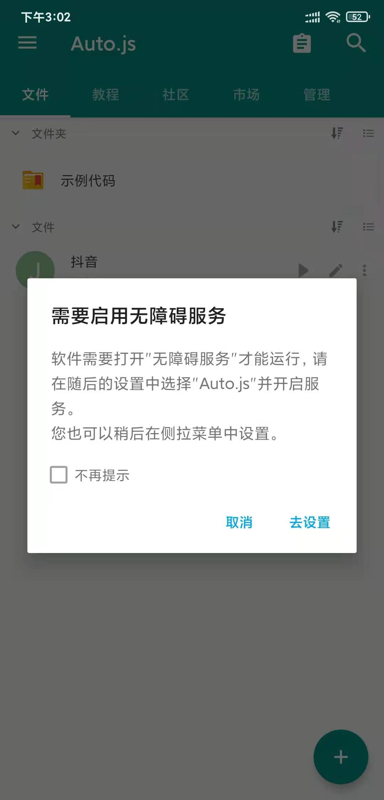
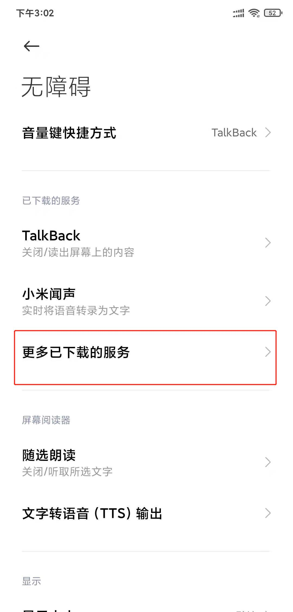
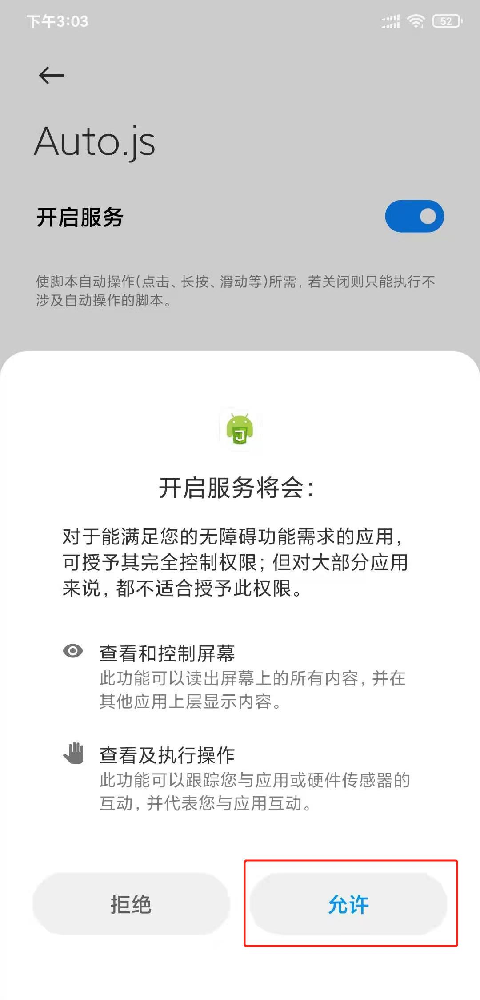
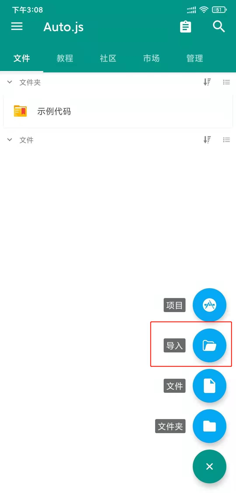
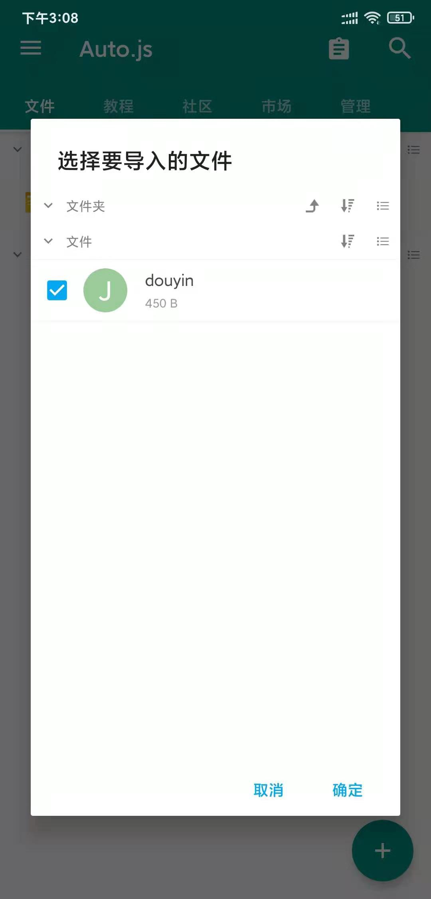
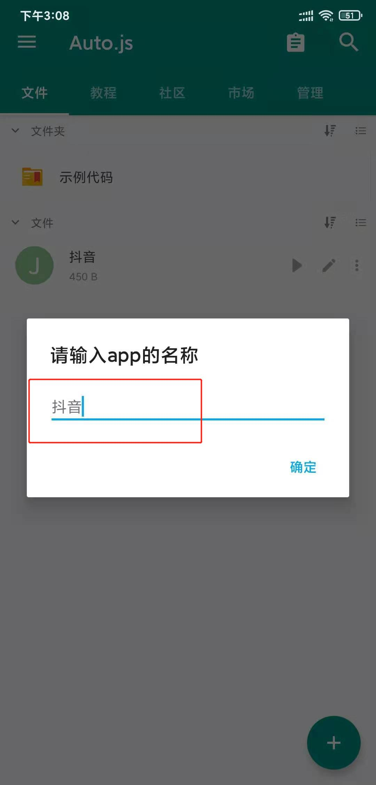
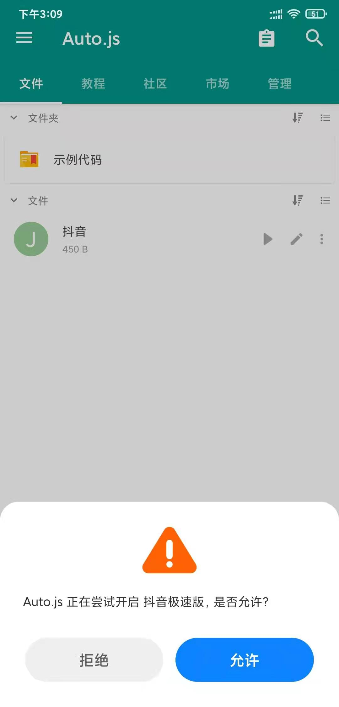

- [钉钉Android手机app打卡脚本](./dingding.js)
    - 点亮屏幕
    - 打开钉钉手机app
    - 填充账号密码登录
    - 基于坐标点击操作，打卡
- [抖音/抖音极速版](./douyin.js)
  - 在Auto.js的app中导入`douyin.js`，启动时输入app名称`抖音/抖音极速版`即可.
- [Auto.js](https://github.com/hyb1996/Auto.js)
  - [Auto.js V4.1.1安卓apk安装包见releases界面](https://github.com/huzing2524/myScripts/files/6019727/auto.js.V4.1.1_alpha2.arm-v7.apk.zip)
    - Auto.js 开源版本已不再维护(原因参见Auto.js Pro FAQ)，后续将只维护Auto.js Pro专业版.
    - 请注意Auto.js 的版本，某些版本无法安装.
    - 当前使用环境：小米8手机，MIUI 12.0.3.0稳定版，Android 10.
  - Auto.js 的使用：
    - 打开Auto.js这个app.
    - 启用无障碍服务. 
    - 无障碍 --> 更多已下载的服务. 
    - 开启服务 --> 允许. 
    - 右下角+按钮 --> 导入. 
    - 从文件夹选择脚本文件. 
    - 输入脚本文件对应的app名称. 
    - 点击脚本文件最左边的运行按钮▷，就会启动对应的app. 
