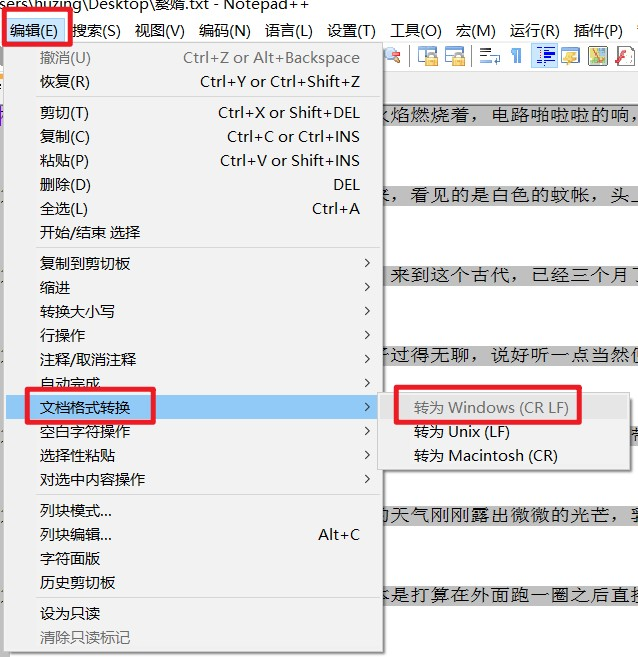
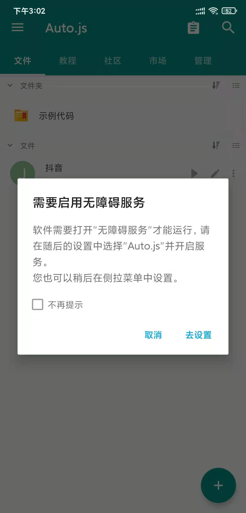
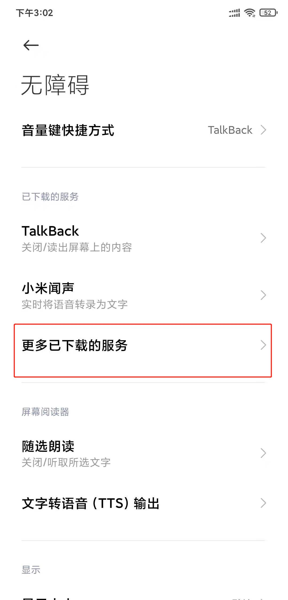
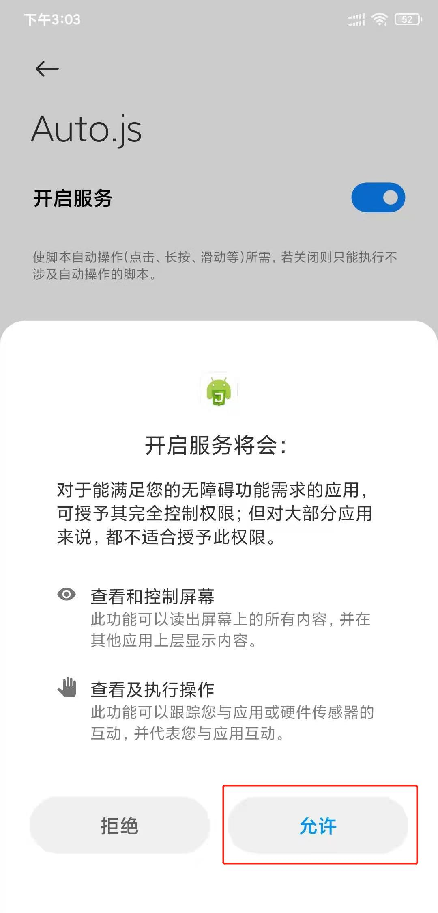
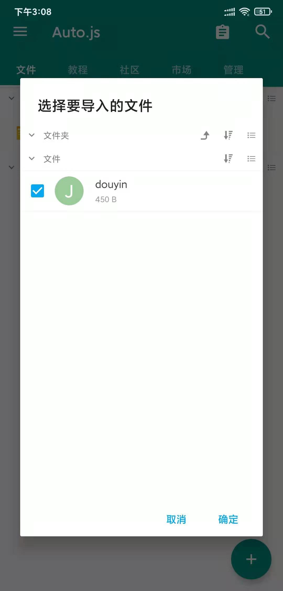
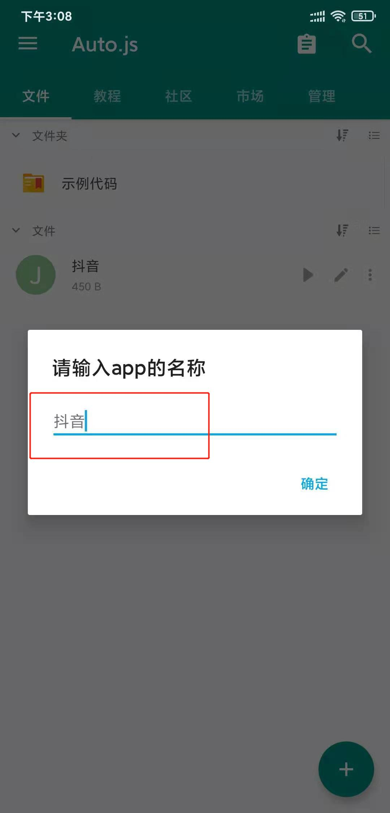

# myScripts
脚本工具合集
- [《赘婿》检查更新 - 邮件提醒 - 每晚自动执行脚本](./zhuixu_checking_update.py)
  - Linux Crontab 定时任务:
    - 命令: crontab [-u username]　　　 // 省略用户表表示操作当前用户的crontab
      - crontab -e　　编辑工作表
      - crontab -l　　列出工作表里的命令
      - crontab -r　　删除工作表
    - 时间格式：* * * * * Command　　　 // 分、时、日、月、周
      - `*` 取值范围内的所有数字
      - `/` 每过多少个数字
      - `-` 从X到Z
      - `,` 散列数字
    - 每晚0:00执行一次：`00 00 * * * /home/huzing2524/.virtualenvs/zhuixu/bin/python3.8 /home/huzing2524/Desktop/zhuixu_checking_update.py >> /home/huzing2524/Desktop/zhuixu.log 2>&1 &`
- [《赘婿》小说爬虫](./zhuixu.py)
  - Linux中空格和换行编码与Windows中不同，在小米手机阅读app中会出现乱码，需转换。
    - 换行
      - Linux: \n
      - Windows: \n\r
    - 空格
      - Linux: LF
      - Windows: CR LF
    - 在NotePad++软件中: 编辑 -> 文档格式转换 -> 转为Windows. 
- [EasyPub下载地址](https://github.com/huzing2524/myScripts/releases)
  - 作用：
    - 生成目录
    - TXT文档转换成EPUB/MOBI格式
  - 使用方式：[参考文章](https://zhuanlan.zhihu.com/p/52400817)
  
- [Auto.js](https://github.com/hyb1996/Auto.js)
  - [Auto.js V4.1.1安卓apk安装包见releases界面](https://github.com/huzing2524/myScripts/files/6019727/auto.js.V4.1.1_alpha2.arm-v7.apk.zip)
    - Auto.js 开源版本已不再维护(原因参见Auto.js Pro FAQ)，后续将只维护Auto.js Pro专业版.
    - 请注意Auto.js 的版本，某些版本无法安装.
    - 当前使用环境：小米8手机，MIUI 12.0.3.0稳定版，Android 10.
  - Auto.js 的使用：
    - 打开Auto.js这个app.
    - 启用无障碍服务. 
    - 无障碍 --> 更多已下载的服务. 
    - 开启服务 --> 允许. 
    - 右下角+按钮 --> 导入. 
    - 从文件夹选择脚本文件. 
    - 输入脚本文件对应的app名称. 
    - 点击脚本文件最左边的运行按钮▷，就会启动对应的app. 
- [抖音/抖音极速版](./douyin.js)
  - 在Auto.js的app中导入`douyin.js`，启动时输入app名称`抖音/抖音极速版`即可.
