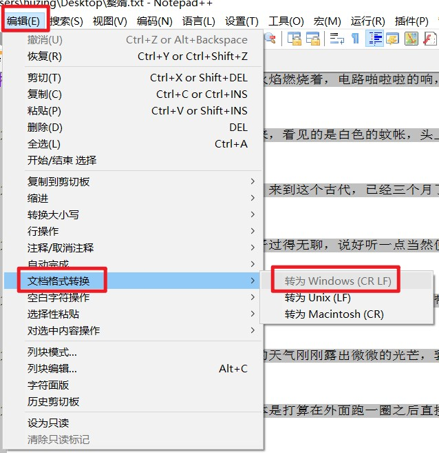

## myScripts
#### 脚本工具合集
- [目录树 层级结构 - Django ORM/SQL 查询](TreeNode/views.py)
- [《赘婿》检查更新 - 邮件提醒 - 每晚自动执行脚本](zhuixu/zhuixu_checking_update.py)
  - Linux Crontab 定时任务:
    - 命令: crontab [-u username]　　　 // 省略用户表表示操作当前用户的crontab
      - crontab -e　　编辑工作表
      - crontab -l　　列出工作表里的命令
      - crontab -r　　删除工作表
    - 时间格式：* * * * * Command　　　 // 分、时、日、月、周
      - `*` 取值范围内的所有数字
      - `/` 每过多少个数字
      - `-` 从X到Z
      - `,` 散列数字
    - 每晚0:00执行一次：`00 00 * * * /home/huzing2524/.virtualenvs/zhuixu/bin/python3.8 /home/huzing2524/Desktop/zhuixu_checking_update.py >> /home/huzing2524/Desktop/zhuixu.log 2>&1 &`
- [《赘婿》小说爬虫](zhuixu/zhuixu.py)
  - Linux中空格和换行编码与Windows中不同，在小米手机阅读app中会出现乱码，需转换。
    - 换行
      - Linux: \n
      - Windows: \n\r
    - 空格
      - Linux: LF
      - Windows: CR LF
    - 在NotePad++软件中: 编辑 -> 文档格式转换 -> 转为Windows. 
- [EasyPub下载地址](https://github.com/huzing2524/myScripts/releases)
  - 作用：
    - 生成目录
    - TXT文档转换成EPUB/MOBI格式
  - 使用方式：[参考文章](https://zhuanlan.zhihu.com/p/52400817)
  
- [1024社区获取邀请码](1024_community)
    - <input type="checkbox" checked>爬虫抓取最新发码帖子</input>自动登录
    - <input type="checkbox">爬虫抓取最新发码帖子</input>验证码识别
        - 第三方打码平台：要花钱
        - 自己训练模型
        - 爬虫抓取验证码图片
    - <input type="checkbox" checked>爬虫抓取最新发码帖子</input>
